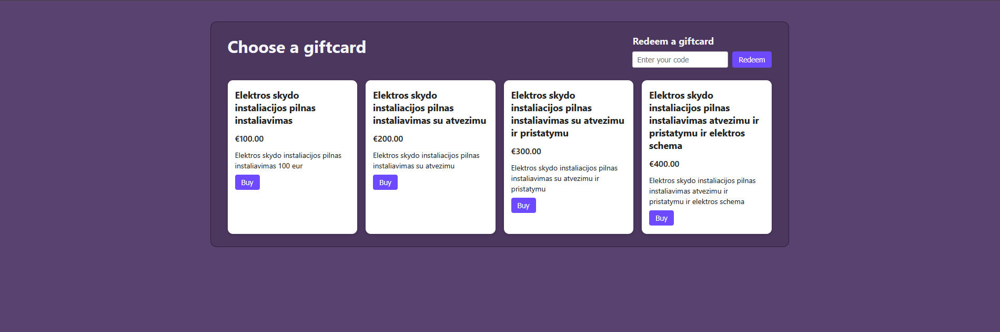

# Giftcard Generator & Redeemer  



*A PHP + MySQL Project*

A full-stack project built using PHP, MySQL, HTML, CSS.  
It allows users to:

- Browse available giftcard tiers  
- Generate unique giftcards  
- Store them in a MySQL database  
- Redeem giftcards using a code  
- Track redeemed vs unused status
- 
---

## Features

### Giftcard Tiers
- Loaded dynamically from the database  
- Includes name, value, and description  
- Only active tiers are displayed  

### Generate Giftcards
- Secure random code using `random_bytes()`  
- Inserted into `giftcards` table  
- Timestamp stored automatically  
- Confirmation page shows the generated code  

### Redeem Giftcards
- Enter a code to redeem  
- Validates unused status  
- Updates DB and stores redemption timestamp  
- Styled success/error pages  

### UI & Styling
- Responsive grid layout for giftcards  
- Minimal design  
- Consistent look using shared CSS  

---

## Project Structure

```
/project
│
├── index.php                # Main page: giftcard list + redeem form
├── create_giftcard.php      # Handles purchase + code generation
├── redeem_giftcard.php      # Handles giftcard redemption
├── database.php             # MySQL connection
├── styles.css               # Main page styling
├── page.css                 # Styling for result pages
└── README.md                # Project documentation
```

---

## Technologies Used

- PHP 8+
- MySQL
- HTML5 / CSS3
- Flexbox & CSS Grid
- XAMPP / Localhost

---

## Database Structure

### Table: `giftcards_tiers`

| Field       | Type            | Description               |
|-------------|-----------------|---------------------------|
| id          | INT (PK)        | Tier ID                   |
| name        | VARCHAR         | Giftcard tier name        |
| value       | DECIMAL(10,2)   | Giftcard value            |
| description | TEXT            | Tier description          |
| is_active   | TINYINT         | 1 = active                |

---

### Table: `giftcards`

| Field        | Type            | Description                       |
|--------------|-----------------|-----------------------------------|
| id           | INT (PK)        | Giftcard ID                       |
| code         | VARCHAR UNIQUE  | Giftcard code                     |
| tier_id      | INT (FK)        | Linked to giftcards_tiers.id      |
| status       | TINYINT         | 0 = unused, 1 = redeemed          |
| created_at   | DATETIME        | When card was generated           |
| redeemed_at  | DATETIME NULL   | When redeemed (if applicable)     |

---

## Running the Project

1. Clone the repository:
```
git clone https://github.com/zorgaslol/giftcard-redeemer
```

2. Import the SQL tables into phpMyAdmin.  
3. Edit `database.php` with your credentials.  
4. Run using XAMPP or any local server.  
5. Open in the browser:

```
http://localhost/your-folder/index.php
```

---

## Purpose

This project was created to practice:

- Full-stack PHP development  
- SQL database design  
- Clean UI layout  
- Secure POST request handling  
- Backend + frontend integration  

---

## License

This project is free to use and modify for personal learning.


